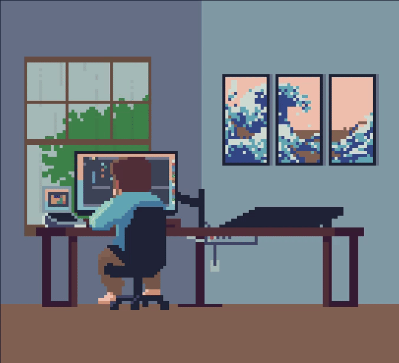

<h2 align="left">✨ Hey there, I’m Muhammad Umer! 👋</h2>

<h4 align="left">🚀 Passionate about Coding, Linux, AI, and Cybersecurity! 
💻 Computer Systems Engineering Student | Full-Stack Web Dev | Arch Linux BTW  
🌐 Building Scalable Web Apps & Living the Terminal Life  
🎶 Vibing to Code & Music nonstop  
🌟 Always building, always learning, always evolving 🚀</h4>

---

### 🛠️ Tech Stack

  <!-- Web & Frontend -->
  
  
  
  
  
  
  
  
  
  <!-- Backend & Databases -->
  
  
  
  
  
  

  <!-- Tools & Platforms -->
  
  
  
  
  

---

### 📊 GitHub Stats

  
  
  

---

### 🐍 Contribution Snake

---

### 🎧 Currently Vibing To

  

---

### 🔗 Let's Connect

  
 
  
  
  

